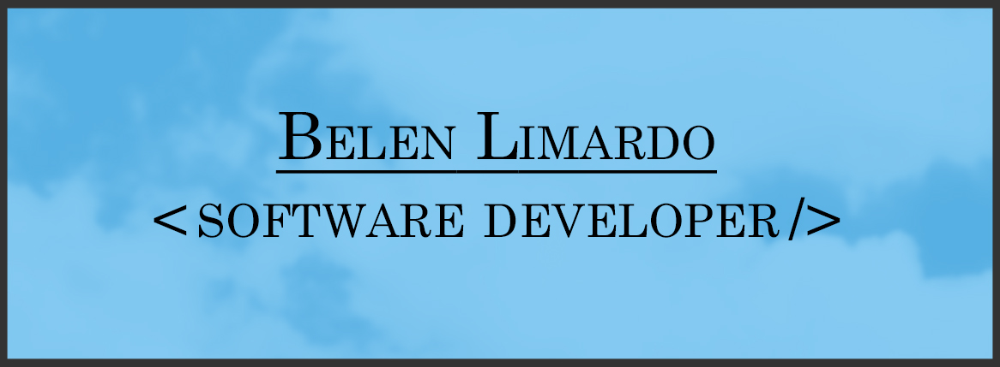

<br>

<br>
<div>
    
    
     
    
    
    
     
</div>
<h2>About me</h2>
<p style="text-align: justify"> My name is Belen and I am a web developer. Apart from studying Software Engineering at university, I invest a lot of time on learning and practicing on my own, using the virtually endless resources of the Internet. I believe this path has been one of the most challenging, yet rewarding I have ever been on. Below are some of the technologies I am familiar with.</p>

```javascript
const aboutMe = {
  developer: "Full Stack",
  technologies: {
    frontEnd: {
           Language: ["Html", "CSS", "Javascript"],
           Frameworks: ["Vue.js", "Node.js", "Tailwind CSS", "Bootstrap", "Livewire", "Laravel Blade"],
           Libraries: ["Inertia.js", "React", "jQuery"]
     },
     backEnd: {
         Language: [ "PHP"],
         Frameworks: ["Laravel"],
         Databases: ["MySQL"],
         Platforms: ["Postman"]
      },
  },
  objective: "Keep learning new technologies and tools."
};
``` 

<h2>My projects</h2>
<p style="text-align: justify"> From E-Commerce sites to Language Learning Web Pages, I have been working on various projects. I invite you to look through my repositories to see the latest ones, even if they are a work in progress. Mostly, I am focusing on deepening my understanding on PHP and Javascript and their various frameworks.</p>
<p style="text-align: justify"> I am especially proud of my Language Learning Website, developed entirely by my using <strong>Laravel and Vue</strong>. It has <strong>interactive</strong> exercises, a complete <strong>admin panel</strong> to create such exercises, <strong>user authentication</strong>, notifications, <strong>unit tests</strong>, an integrated dictionary and many other features. I am currently working on cleaning up my controllers on the backend, adding accesibility on the frontend and fixing some minor bugs.</p>

<h2><strong>Contact me: <strong></h2>
<div style="display: flex">
<a href="https://www.linkedin.com/in/belen-limardo/" target="_blank" alt="LinkedIn">
      
    </a> 
<a href="mailto:belenrociolimardo@gmail.com" target="_blank" alt="Mail">
    
</a>
</div>

   <h3>Thank you for reading!</h3>
